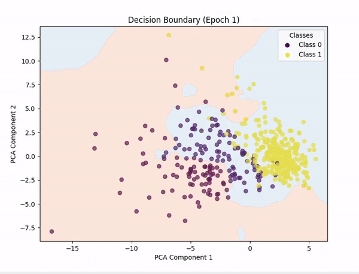

# Neuralnetlib

## 📝 Description

This is a handmade deep learning framework library, made in python, **using numpy as its only external dependency**.

I made it to challenge myself and to learn more about deep neural networks, how they work _in depth_.

The big part of this project, meaning the [Multilayer Perceptron (MLP)](https://en.wikipedia.org/wiki/Multilayer_perceptron) part, was made in a week.

I then decided to push it even further by adding [Convolutional Neural Networks (CNN)](https://en.wikipedia.org/wiki/Convolutional_neural_network),  [Recurrent Neural Networks (RNN)](https://en.wikipedia.org/wiki/Recurrent_neural_network), [Autoencoders](https://en.wikipedia.org/wiki/Autoencoder) and Variational [Autoencoders (VAE)](https://en.wikipedia.org/wiki/Variational_autoencoder).

This project will be maintained as long as I have ideas to improve it, and as long as I have time to work on it.

## 📦 Features

- Many models architectures (sequential, functional, autoencoder) 🏗
- Many layers (dense, dropout, conv1d/2d, pooling1d/2d, flatten, embedding, batchnormalization, textvectorization, lstm, gru, attention and more) 🧠
- Many activation functions (sigmoid, tanh, relu, leaky relu, softmax, linear, elu, selu) 📈
- Many loss functions (mean squared error, mean absolute error, categorical crossentropy, binary crossentropy, huber loss) 📉
- Many optimizers (sgd, momentum, rmsprop, adam) 📊
- Supports binary classification, multiclass classification, regression and text generation 📚
- Preprocessing tools (tokenizer, pca, ngram, standardscaler, pad_sequences, one_hot_encode and more) 🛠
- Callbacks and regularizers (early stopping, l1/l2 regularization) 📉
- Save and load models 📁
- Simple to use 📚

## ⚙️ Installation

You can install the library using pip:

```bash
pip install neuralnetlib
```

## 💡 How to use

See [this file](examples/classification-regression/mnist_multiclass.ipynb) for a simple example of how to use the library.<br>
For a more advanced example, see [this file](examples/cnn-classification/cnn_classification_mnist.ipynb) for using CNN.<br>
You can also check [this file](examples/classification-regression/sentiment_analysis.ipynb) for text classification using RNN.<br>

More examples in [this folder](examples).

You are free to tweak the hyperparameters and the network architecture to see how it affects the results.

## 🚀 Quick examples (more [here](examples/))

### Binary Classification

```python
from neuralnetlib.models import Sequential
from neuralnetlib.layers import Input, Dense
from neuralnetlib.activations import Sigmoid
from neuralnetlib.losses import BinaryCrossentropy
from neuralnetlib.optimizers import SGD
from neuralnetlib.metrics import accuracy_score

# ... Preprocess x_train, y_train, x_test, y_test if necessary (you can use neuralnetlib.preprocess and neuralnetlib.utils)

# Create a model
model = Sequential()
model.add(Input(10))  # 10 features
model.add(Dense(8))
model.add(Dense(1))
model.add(Activation(Sigmoid()))  # many ways to tell the model which Activation Function you'd like, see the next example

# Compile the model
model.compile(loss_function='bce', optimizer='sgd')

# Train the model
model.fit(X_train, y_train, epochs=10, batch_size=32, metrics=['accuracy'])
```

### Multiclass Classification

```python
from neuralnetlib.activations import Softmax
from neuralnetlib.losses import CategoricalCrossentropy
from neuralnetlib.optimizers import Adam
from neuralnetlib.metrics import accuracy_score

# ... Preprocess x_train, y_train, x_test, y_test if necessary (you can use neuralnetlib.preprocess and neuralnetlib.utils)

# Create and compile a model
model = Sequential()
model.add(Input(28, 28, 1)) # For example, MNIST images
model.add(Conv2D(32, kernel_size=3, padding='same'), activation='relu')  # activation supports both str...
model.add(BatchNormalization())
model.add(MaxPooling2D(pool_size=2))
model.add(Dense(64, activation='relu'))
model.add(Dense(10, activation=Softmax()))  # ... and ActivationFunction objects
model.compile(loss_function='categorical_crossentropy', optimizer=Adam())


model.compile(loss_function='categorical_crossentropy', optimizer=Adam())  # same for loss_function and optimizer

# Train the model
model.fit(X_train, y_train_ohe, epochs=5, metrics=['accuracy'])
```

### Regression

```python
from neuralnetlib.losses import MeanSquaredError
from neuralnetlib.metrics import accuracy_score

# ... Preprocess x_train, y_train, x_test, y_test if necessary (you can use neuralnetlib.preprocess and neuralnetlib.utils)

# Create and compile a model
model = Sequential()
model.add(Input(13))
model.add(Dense(64, activation='leakyrelu'))
model.add(Dense(1), activation="linear")

model.compile(loss_function="mse", optimizer='adam')  # you can either put acronyms or full name

# Train the model
model.fit(X_train, y_train, epochs=100, batch_size=128, metrics=['accuracy'])
```

You can also save and load models:

```python
# Save a model
model.save('my_model.json')

# Load a model
model = Model.load('my_model.json')
```

## 📜 Output of the example file

### Here is the decision boundary on a Binary Classification (breast cancer dataset):



> [!NOTE]
> PCA (Principal Component Analysis) was used to reduce the number of features to 2, so we could plot the decision boundary.
> Representing n-dimensional data in 2D is not easy, so the decision boundary may not be *always* accurate.
> I also tried with t-SNE, but the results were not good.

### Here is an example of a model training on the mnist using the library


### Here is an example of a loaded model used with Tkinter:


### Here, I decided to print the first 10 predictions and their respective labels to see how the network is performing.


### Here is the generated dinosaur names using a simple RNN and a list of existing dinosaur names.


**You can __of course__ use the library for any dataset you want.**

## 🎯 TODO

- [ ] Switch from NCHW to NHWC for better performance on CPU
- [ ] Add more model architecture support (like transformers, etc)
- [ ] Add more preprocessing tools (like data augmentation, etc)
- [ ] Add support for stream dataset loading to allow loading large datasets (larger than your RAM)
- [ ] Add more callbacks
- [ ] Add more layers
- [ ] Add cuDNN support to allow the use of GPUs
- [ ] Visual updates (tabulation of model.summary() parameters calculation, colorized progress bar, etc.)

## ✍️ Authors

- Marc Pinet - *Initial work* - [marcpinet](https://github.com/marcpinet)
